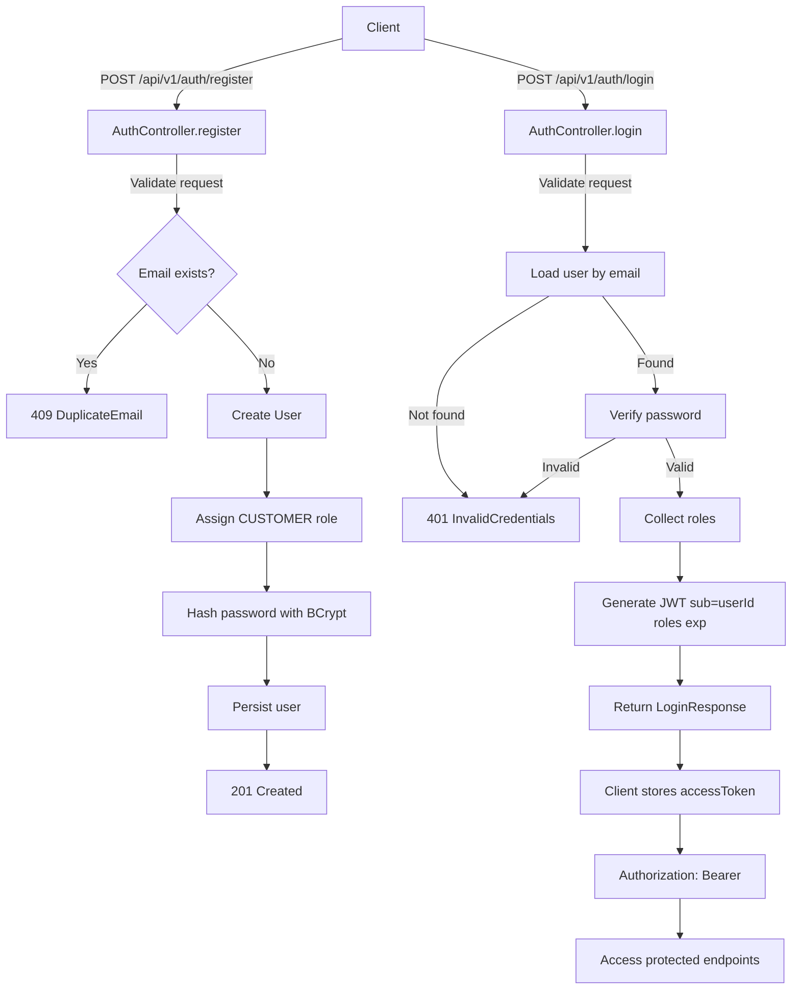
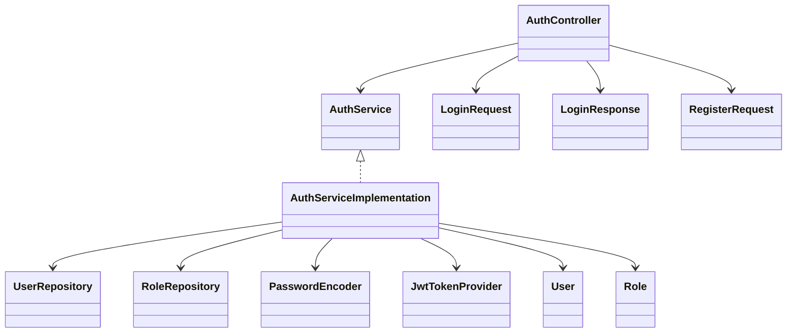
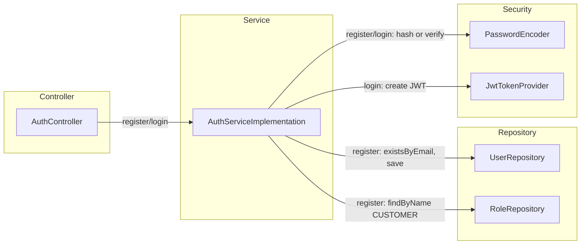

# AuthController Flow Diagram

## Diagram 1: Classes Involved

## Diagram 2: Layered View (Controller -> Service -> Repository)

Notes:
- Login returns `accessToken` and `tokenType` (current implementation).
- JWT subject (`sub`) is the user id; `roles` claim is included in the token.
- Error responses follow the common error schema in `GIVEN/api-request-response-schemas.md`.
- This layered view shows the main collaborators used by register/login.
- The service depends on repositories for user/role data and on security helpers for password hashing and JWT creation.
