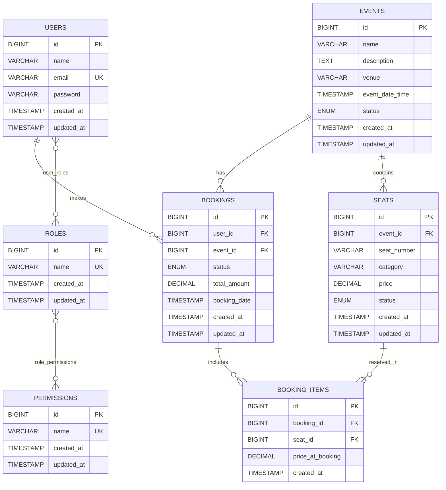

# Event Ticketing System — Entity Relationship Diagram

> **Source:** Product Requirements Document + Epics & User Stories
> **Tech Stack:** Spring Data JPA / Hibernate · PostgreSQL / MySQL
> **Last Updated:** 2026-04-04

---

## ERD Diagram

---

## Table Schemas

### 1. `USERS`

Stores all registered users (both ADMIN and CUSTOMER).

| Column | Type | Constraints | Notes |
|--------|------|-------------|-------|
| `id` | BIGINT | PK, AUTO_INCREMENT | System-generated surrogate key |
| `name` | VARCHAR(100) | NOT NULL | Full name |
| `email` | VARCHAR(255) | NOT NULL, UNIQUE | Used for login; immutable after creation |
| `password` | VARCHAR(255) | NOT NULL | BCrypt-hashed; never returned in API responses |
| `created_at` | TIMESTAMP | NOT NULL | Set on insert; managed by JPA `@CreationTimestamp` |
| `updated_at` | TIMESTAMP | NOT NULL | Updated on every change; managed by `@UpdateTimestamp` |

**Indexes:**
- `UNIQUE INDEX` on `email`

---

### 2. `ROLES`

Defines named roles that can be assigned to users (e.g., `ADMIN`, `CUSTOMER`).

| Column | Type | Constraints | Notes |
|--------|------|-------------|-------|
| `id` | BIGINT | PK, AUTO_INCREMENT | System-generated surrogate key |
| `name` | VARCHAR(100) | NOT NULL, UNIQUE | e.g., `ADMIN`, `CUSTOMER`, `MODERATOR` |
| `created_at` | TIMESTAMP | NOT NULL | Set on insert; managed by `@CreationTimestamp` |
| `updated_at` | TIMESTAMP | NOT NULL | Managed by `@UpdateTimestamp` |

**Indexes:**
- `UNIQUE INDEX` on `name`

---

### 3. `PERMISSIONS`

Defines granular permission strings that can be assigned to roles (e.g., `CREATE_EVENT`, `BOOK_SEAT`).

| Column | Type | Constraints | Notes |
|--------|------|-------------|-------|
| `id` | BIGINT | PK, AUTO_INCREMENT | System-generated surrogate key |
| `name` | VARCHAR(100) | NOT NULL, UNIQUE | e.g., `CREATE_EVENT`, `BOOK_SEAT`, `DISABLE_SEAT` |
| `created_at` | TIMESTAMP | NOT NULL | Set on insert; managed by `@CreationTimestamp` |
| `updated_at` | TIMESTAMP | NOT NULL | Managed by `@UpdateTimestamp` |

**Indexes:**
- `UNIQUE INDEX` on `name`

---

### 4. `user_roles` *(Join Table)*

Implements the **Many-to-Many** relationship between `USERS` and `ROLES`.

| Column | Type | Constraints | Notes |
|--------|------|-------------|-------|
| `user_id` | BIGINT | PK (composite), FK → `USERS.id` | Cascade delete with user |
| `role_id` | BIGINT | PK (composite), FK → `ROLES.id` | — |

**Primary Key:** `(user_id, role_id)`

**Foreign Keys:**
- `user_id` → `USERS(id)` ON DELETE CASCADE
- `role_id` → `ROLES(id)` ON DELETE CASCADE

---

### 5. `role_permissions` *(Join Table)*

Implements the **Many-to-Many** relationship between `ROLES` and `PERMISSIONS`.

| Column | Type | Constraints | Notes |
|--------|------|-------------|-------|
| `role_id` | BIGINT | PK (composite), FK → `ROLES.id` | — |
| `permission_id` | BIGINT | PK (composite), FK → `PERMISSIONS.id` | — |

**Primary Key:** `(role_id, permission_id)`

**Foreign Keys:**
- `role_id` → `ROLES(id)` ON DELETE CASCADE
- `permission_id` → `PERMISSIONS(id)` ON DELETE CASCADE

---

### 6. `EVENTS`

Stores all events managed by admins.

| Column | Type | Constraints | Notes |
|--------|------|-------------|-------|
| `id` | BIGINT | PK, AUTO_INCREMENT | System-generated surrogate key |
| `name` | VARCHAR(200) | NOT NULL | Event title |
| `description` | TEXT | NULLABLE | Optional long description |
| `venue` | VARCHAR(300) | NOT NULL | Location / venue name |
| `event_date_time` | TIMESTAMP | NOT NULL | Must be a future date/time on creation |
| `status` | ENUM | NOT NULL, DEFAULT `'INACTIVE'` | `ACTIVE` \| `INACTIVE` |
| `created_at` | TIMESTAMP | NOT NULL | Managed by `@CreationTimestamp` |
| `updated_at` | TIMESTAMP | NOT NULL | Managed by `@UpdateTimestamp` |

**Allowed `status` values:** `ACTIVE` | `INACTIVE`

**Indexes:**
- `INDEX` on `status` (frequent filter: customers browse only `ACTIVE` events)
- `INDEX` on `event_date_time` (common sort column)

---

### 7. `SEATS`

Stores individual seats belonging to an event.

| Column | Type | Constraints | Notes |
|--------|------|-------------|-------|
| `id` | BIGINT | PK, AUTO_INCREMENT | System-generated surrogate key |
| `event_id` | BIGINT | NOT NULL, FK → `EVENTS.id` | Parent event |
| `seat_number` | VARCHAR(20) | NOT NULL | e.g., `A12`, `VIP-01` |
| `category` | VARCHAR(50) | NOT NULL | e.g., `VIP`, `STANDARD`, `ECONOMY` |
| `price` | DECIMAL(10,2) | NOT NULL, CHECK > 0 | Current seat price |
| `status` | ENUM | NOT NULL, DEFAULT `'AVAILABLE'` | `AVAILABLE` \| `BOOKED` \| `DISABLED` |
| `created_at` | TIMESTAMP | NOT NULL | Set on insert; managed by `@CreationTimestamp` |
| `updated_at` | TIMESTAMP | NOT NULL | Managed by `@UpdateTimestamp` |

**Allowed `status` values:** `AVAILABLE` | `BOOKED` | `DISABLED`

**Constraints:**
- `UNIQUE (event_id, seat_number)` — no duplicate seat numbers per event

**Foreign Keys:**
- `event_id` → `EVENTS(id)` ON DELETE CASCADE

**Indexes:**
- `UNIQUE INDEX` on `(event_id, seat_number)`
- `INDEX` on `(event_id, status)` (frequent query: find AVAILABLE seats for an event)
- `INDEX` on `event_id`

---

### 8. `BOOKINGS`

Represents a customer's booking header record for one or more seats at an event.

| Column | Type | Constraints | Notes |
|--------|------|-------------|-------|
| `id` | BIGINT | PK, AUTO_INCREMENT | System-generated surrogate key |
| `user_id` | BIGINT | NOT NULL, FK → `USERS.id` | Booking owner (derived from JWT, not client-supplied) |
| `event_id` | BIGINT | NOT NULL, FK → `EVENTS.id` | The event being booked |
| `status` | ENUM | NOT NULL, DEFAULT `'PENDING_PAYMENT'` | Booking lifecycle status |
| `total_amount` | DECIMAL(10,2) | NOT NULL, CHECK > 0 | Sum of all `BOOKING_ITEMS.price_at_booking`; snapshotted at booking time |
| `booking_date` | TIMESTAMP | NOT NULL | The date/time the booking was initiated; set on insert |
| `created_at` | TIMESTAMP | NOT NULL | Managed by `@CreationTimestamp` |
| `updated_at` | TIMESTAMP | NOT NULL | Managed by `@UpdateTimestamp` |

**Allowed `status` values:**

| Status | Transitions To | Description |
|--------|---------------|-------------|
| `PENDING_PAYMENT` | `CONFIRMED`, `CANCELLED`, `PAYMENT_FAILED` | Initial state on booking creation |
| `CONFIRMED` | *(terminal)* | Payment accepted; seats locked |
| `CANCELLED` | *(terminal)* | Customer cancelled; seats released |
| `PAYMENT_FAILED` | *(terminal)* | Payment failed; seats released |

**Foreign Keys:**
- `user_id` → `USERS(id)`
- `event_id` → `EVENTS(id)`

**Indexes:**
- `INDEX` on `user_id` (customer queries their own bookings)
- `INDEX` on `event_id` (admin filters bookings by event)
- `INDEX` on `status` (admin filters bookings by status)
- `INDEX` on `(user_id, status)` (customer filters own bookings by status)

---

### 9. `BOOKING_ITEMS`

Stores each individual seat line within a booking. `price_at_booking` is a **price snapshot** captured at booking time — it is immutable and does not change if the seat price is later updated by an admin.

| Column | Type | Constraints | Notes |
|--------|------|-------------|-------|
| `id` | BIGINT | PK, AUTO_INCREMENT | System-generated surrogate key |
| `booking_id` | BIGINT | NOT NULL, FK → `BOOKINGS.id` | Parent booking |
| `seat_id` | BIGINT | NOT NULL, FK → `SEATS.id` | The seat that was booked |
| `price_at_booking` | DECIMAL(10,2) | NOT NULL, CHECK > 0 | **Snapshot** — price paid at booking time; never changes after insert |
| `created_at` | TIMESTAMP | NOT NULL | Set on insert; managed by `@CreationTimestamp` |

**Foreign Keys:**
- `booking_id` → `BOOKINGS(id)` ON DELETE CASCADE
- `seat_id` → `SEATS(id)`

**Indexes:**
- `INDEX` on `booking_id`
- `INDEX` on `seat_id`

---

## Relationships Summary

| Relationship | Type | Tables | ERD Notation | Description |
|-------------|------|--------|-------------|-------------|
| User ↔ Role | Many-to-Many | `USERS`, `ROLES`, `user_roles` | `}o--o{` | A user can have zero or more roles; a role can be assigned to zero or more users |
| Role ↔ Permission | Many-to-Many | `ROLES`, `PERMISSIONS`, `role_permissions` | `}o--o{` | A role can have zero or more permissions; a permission can belong to zero or more roles |
| Event → Seat | One-to-Many | `EVENTS`, `SEATS` | `\|\|--o{` | An event contains zero or more seats; each seat belongs to exactly one event |
| User → Booking | One-to-Many | `USERS`, `BOOKINGS` | `\|\|--o{` | A user can have zero or more bookings; each booking belongs to exactly one user |
| Event → Booking | One-to-Many | `EVENTS`, `BOOKINGS` | `\|\|--o{` | An event can have zero or more bookings; each booking is for exactly one event |
| Booking → BookingItem | One-to-Many | `BOOKINGS`, `BOOKING_ITEMS` | `\|\|--o{` | A booking has one or more items; each item belongs to exactly one booking |
| Seat → BookingItem | One-to-Many | `SEATS`, `BOOKING_ITEMS` | `\|\|--o{` | A seat can appear in zero or more booking items (across multiple bookings over time); each item references exactly one seat |

---

## Key Constraints

| Constraint | Table | Columns | Type | Reason |
|-----------|-------|---------|------|--------|
| Unique email | `USERS` | `email` | UNIQUE | Prevents duplicate accounts |
| Unique seat per event | `SEATS` | `(event_id, seat_number)` | UNIQUE | Prevents duplicate seat numbers within the same event |
| Unique role name | `ROLES` | `name` | UNIQUE | Prevents duplicate roles |
| Unique permission name | `PERMISSIONS` | `name` | UNIQUE | Prevents duplicate permissions |
| Positive seat price | `SEATS` | `price` | CHECK (`price > 0`) | Business rule |
| Positive booking total amount | `BOOKINGS` | `total_amount` | CHECK (`total_amount > 0`) | Business rule |
| Positive price at booking | `BOOKING_ITEMS` | `price_at_booking` | CHECK (`price_at_booking > 0`) | Ensures a valid price was captured |

---

## Transactional Boundaries

The following operations must execute within a single `@Transactional` block to ensure atomicity:

| Operation | Tables Modified | Rollback Condition |
|-----------|----------------|-------------------|
| **Create Booking** | `BOOKINGS` (INSERT), `BOOKING_ITEMS` (INSERT), `SEATS` (UPDATE `status` → `BOOKED`) | Any seat is not `AVAILABLE`; event is not `ACTIVE` |
| **Cancel Booking** | `BOOKINGS` (UPDATE `status` → `CANCELLED`), `SEATS` (UPDATE `status` → `AVAILABLE`) | Booking not in `PENDING_PAYMENT` state |
| **Report Payment Failure** | `BOOKINGS` (UPDATE `status` → `PAYMENT_FAILED`), `SEATS` (UPDATE `status` → `AVAILABLE`) | Booking not in `PENDING_PAYMENT` state |
