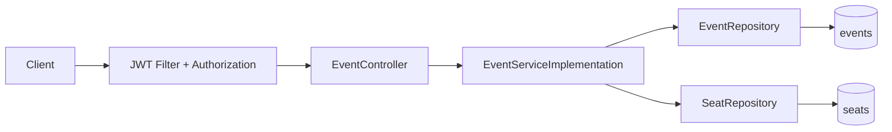

# Event API Flows

This document describes end-to-end flow for all Event APIs in the current implementation.

## Covered Endpoints

- `POST /api/v1/events` (create event)
- `PUT /api/v1/events/{eventId}` (update event details)
- `PATCH /api/v1/events/{eventId}/status` (activate/deactivate event)
- `GET /api/v1/events` (list active events)
- `GET /api/v1/events/{eventId}` (get event by id)
- `DELETE /api/v1/events/{eventId}` (soft delete event)

## High-Level Flow

## Detailed Sequence Diagram

```mermaid
%%{init: {"theme":"default"}}%%
sequenceDiagram
    autonumber
    actor Client
    participant Sec as Security (JWT + PreAuthorize)
    participant Ctrl as EventController
    participant Svc as EventServiceImplementation
    participant EventRepo as EventRepository
    participant SeatRepo as SeatRepository
    participant DB as MySQL

    Note over Client,DB: 1) Create Event — POST /api/v1/events
    Client->>Sec: Request (event.create)
    Sec-->>Ctrl: Authorized
    Ctrl->>Svc: createEvent(request)
    Svc->>Svc: validateFutureDate()
    Svc->>Svc: set status = INACTIVE
    Svc->>EventRepo: save(event)
    EventRepo->>DB: INSERT events
    DB-->>EventRepo: saved
    EventRepo-->>Svc: Event
    Svc-->>Ctrl: EventResponse
    Ctrl-->>Client: 201 Created

    Note over Client,DB: 2) Update Event — PUT /api/v1/events/{eventId}
    Client->>Sec: Request (event.update)
    Sec-->>Ctrl: Authorized
    Ctrl->>Svc: updateEvent(eventId, request)
    Svc->>Svc: validateFutureDate()
    Svc->>EventRepo: findById(eventId)
    EventRepo->>DB: SELECT event
    DB-->>EventRepo: event / none
    alt event not found
        Svc-->>Ctrl: ResourceNotFoundException
        Ctrl-->>Client: 404
    else found
        Svc->>EventRepo: save(updated fields)
        EventRepo->>DB: UPDATE events
        DB-->>EventRepo: OK
        Svc-->>Ctrl: EventResponse
        Ctrl-->>Client: 200 OK
    end

    Note over Client,DB: 3) Update Status — PATCH /api/v1/events/{eventId}/status
    Client->>Sec: Request (event.update)
    Sec-->>Ctrl: Authorized
    Ctrl->>Svc: updateEventStatus(eventId, request)
    Svc->>EventRepo: findById(eventId)
    EventRepo->>DB: SELECT event
    DB-->>EventRepo: event / none
    alt event not found
        Svc-->>Ctrl: ResourceNotFoundException
        Ctrl-->>Client: 404
    else found
        alt same status
            Svc-->>Ctrl: ConflictException (already active/inactive)
            Ctrl-->>Client: 409
        else target ACTIVE
            Svc->>SeatRepo: existsByEvent_Id(eventId)
            SeatRepo->>DB: SELECT EXISTS seats
            DB-->>SeatRepo: true/false
            alt no seats
                Svc-->>Ctrl: ConflictException(EventHasNoSeats)
                Ctrl-->>Client: 409
            else has seats
                Svc->>EventRepo: save(status=ACTIVE)
                EventRepo->>DB: UPDATE events
                DB-->>EventRepo: OK
                Ctrl-->>Client: 200 OK
            end
        else target INACTIVE
            Svc->>Svc: set bookings = CANCELLED
            Svc->>SeatRepo: findByEvent_Id(eventId)
            SeatRepo->>DB: SELECT seats
            DB-->>SeatRepo: seat list
            Svc->>Svc: set seat.status = DISABLED
            Svc->>SeatRepo: saveAll(seats)
            SeatRepo->>DB: UPDATE seats batch
            DB-->>SeatRepo: OK
            Svc->>EventRepo: save(status=INACTIVE)
            EventRepo->>DB: UPDATE events
            DB-->>EventRepo: OK
            Ctrl-->>Client: 200 OK
        end
    end

    Note over Client,DB: 4) List Active Events — GET /api/v1/events
    Client->>Sec: Request (event.read)
    Sec-->>Ctrl: Authorized
    Ctrl->>Svc: listActiveEvents(limit, offset, sort)
    Svc->>Svc: resolve paging/sort + clamp limit
    Svc->>EventRepo: findByStatus(ACTIVE, pageable)
    EventRepo->>DB: SELECT ... WHERE status='ACTIVE'
    DB-->>EventRepo: page of events
    Svc-->>Ctrl: PagedResponse<EventResponse>
    Ctrl-->>Client: 200 OK

    Note over Client,DB: 5) Get Event By ID — GET /api/v1/events/{eventId}
    Client->>Sec: Request (event.read)
    Sec-->>Ctrl: Authorized
    Ctrl->>Svc: getEventById(eventId)
    Svc->>EventRepo: findById(eventId)
    EventRepo->>DB: SELECT event
    DB-->>EventRepo: event / none
    alt not found or not ACTIVE
        Svc-->>Ctrl: ResourceNotFoundException
        Ctrl-->>Client: 404
    else ACTIVE event
        Svc-->>Ctrl: EventResponse
        Ctrl-->>Client: 200 OK
    end

    Note over Client,DB: 6) Delete Event — DELETE /api/v1/events/{eventId}
    Client->>Sec: Request (event.delete)
    Sec-->>Ctrl: Authorized
    Ctrl->>Svc: deleteEvent(eventId)
    Svc->>EventRepo: findById(eventId)
    EventRepo->>DB: SELECT event
    DB-->>EventRepo: event / none
    alt not found
        Svc-->>Ctrl: ResourceNotFoundException
        Ctrl-->>Client: 404
    else found
        Svc->>Svc: soft-delete booking items + bookings
        Svc->>SeatRepo: findByEvent_Id(eventId)
        SeatRepo->>DB: SELECT seats
        DB-->>SeatRepo: seat list
        Svc->>Svc: set seats.deleted = true
        Svc->>SeatRepo: saveAll(seats)
        SeatRepo->>DB: UPDATE seats
        DB-->>SeatRepo: OK
        Svc->>Svc: set event.deleted = true
        Svc->>EventRepo: save(event)
        EventRepo->>DB: UPDATE events
        DB-->>EventRepo: OK
        Ctrl-->>Client: 204 No Content
    end
```

## Business Rules Snapshot

- New event is always created as `INACTIVE`.
- Activation requires at least one seat (`EventHasNoSeats` on failure).
- Deactivation sets:
  - all related bookings to `CANCELLED`
  - all related seats to `DISABLED`
- Delete performs soft-delete on:
  - event
  - related seats
  - related bookings and booking items
- List API returns only `ACTIVE` events.
- Get-by-id returns `404` if event is missing or not active.
